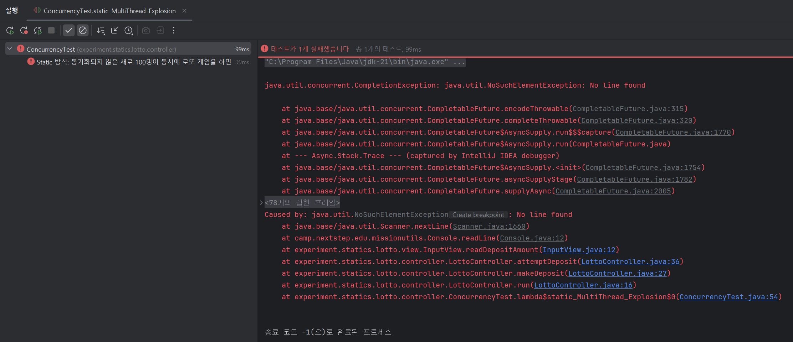
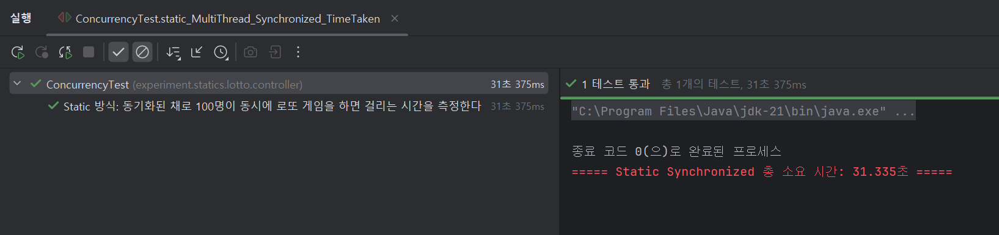
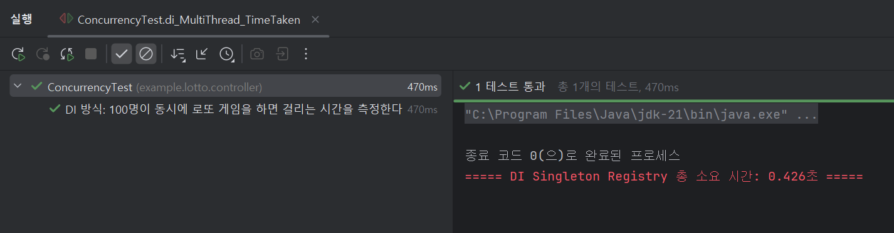

# 🔬 실험 보고서: Static vs DI 아키텍처 비교

## 1. 개요
본 실험은 자바 애플리케이션 개발 시 흔히 고민하게 되는 두 가지 설계 방식, **Static(전역 상태/유틸리티) 방식**과 **DI(의존성 주입/싱글톤 컨테이너) 방식**의 장단점을 실제 코드로 검증하기 위해 진행되었습니다.

단순한 이론적 비교를 넘어, 실제 **로또 게임**을 두 가지 방식으로 구현하고 **테스트 용이성**과 **동시성 환경에서의 안정성**을 비교 분석했습니다.

---

## 2. 아키텍처 구조 비교

### 2-1. Static 아키텍처: 강한 결합
컨트롤러와 서비스, 로또 번호 생성기가 `static` 메서드로 구현되어 있습니다.

```java
// experiment.statics.lotto.PurchaseService.java 일부
public class PurchaseService {
    public static Lottos purchaseLottos(DepositAmount amount) {
        ...
        // 로또 번호 생성기 관련 내용이 하드코딩되어 로또 번호 생성 로직 외부에서 교체 불가
        List<Integer> lottoNumbers = RandomLottoNumberGenerator.generateUniqueNumbersInRange();
        ...
    }
}
```

### 2-2. DI 아키텍처: 느슨한 결합
직접 구현한 **DI 컨테이너**(`myframework`)를 통해 의존성을 관리합니다. 객체는 **싱글톤**으로 관리되지만, 생성자를 통해 의존성을 주입받으므로 유연한 구조를 가집니다.

```java
// example.lotto.PurchaseService.java 일부
@Component
public class PurchaseService {
    private final LottoNumberGenerator lottoNumberGenerator;

    @Autowired // 로또 번호 생성기를 외부에서 주입받으므로 로또 번호 생성 로직을 외부에서 교체 가능
    public PurchaseService(LottoNumberGenerator lottoNumberGenerator) {
        this.lottoNumberGenerator = lottoNumberGenerator;
    }
}
```

---

## 3. 실험 1: 테스트 용이성

**가설**: Static 방식은 내부 의존성을 제어할 수 없어 비즈니스 로직의 정밀한 검증이 불가능할 것이다.

### 3-1. Static 방식의 한계
- **로또 구매 로직 테스트 시도**
  - **결과**: 내부의 `RandomLottoNumberGenerator`를 고정된 값을 반환하는 객체로 교체할 방법이 없음.
  - **결론**: 시나리오 별 **비즈니스 로직 검증 포기**. 전체 흐름(동작 여부)만 확인하는 테스트가 됨.

### 3-2. DI 방식의 성공
- **로또 구매 로직 테스트**
  - **해결**: 생성자 주입을 통해 정해진 값을 반환하는 로또 번호 생성기 주입.
  - **결론**: **100% 통제 가능한 환경**에서 원하는 시나리오를 활용해 흐름과 로직 모두 검증 성공.

> DI 방식은 통제하기 용이해 더욱 다양한, **원하는 시나리오로 단위 테스트가 가능함**을 확인했습니다.

---

## 4. 실험 2: 동시성 및 성능

**가설**: Static 방식은 전역 자원(`System.in`) 공유 문제로 인해 멀티스레드 환경에서 치명적인 결함을 보일 것이다.

### 4-1. 1차 시도: 동기화 미적용 → 실행 오류 발생
- **조건**: 100명의 사용자가 동시에 로또 구매 시도.
- **현상**: 여러 스레드가 `System.in`을 동시에 점유하려다 입력 스트림이 꼬이거나 닫힘.
- **결과**: `NoSuchElementException`이 발생하며 **100% 실행 오류. 가용성 0%.**
    
    <br>

### 4-2. 2차 시도: 동기화 적용 → 병목 현상 발생
- **조치**: `Controller.run()` 메서드 전체에 `synchronized` 키워드 적용.
- **현상**: 데이터 무결성은 지켜졌으나, 100명의 사용자가 한 줄로 서서 처리됨 (직렬화).
- **시간 측정 결과 (100명 기준, 입력 지연 0.3초로 가정):**
    - **Static (Synchronized):** 약 **31.335초** 소요. → 사실상 단일 스레드
        
        <br>
    - **DI (Singleton):** 약 **0.426초** 소요. → 완벽한 병렬 처리
        
        <br>

### 4-3. 심화 분석: 동기화의 역설 (싱글 스레드보다 느린 멀티스레드)
- "과연 Static 구조에서 동기화된 멀티스레드가 싱글 스레드와 얼마나 다를까?"를 확인하기 위해 수행 시간을 비교했습니다.
```java
// 결과: 멀티스레드임에도 불구하고 락 대기 시간 + 스레드 생성 비용으로 인해 더 느려짐
assertThat(timeTakenOnMultiThread).isGreaterThan(timeTakenOnSingleThread);
```
- **결론**: 멀티스레드를 썼지만 싱글 스레드보다 성능이 나쁜 역설적 상황 발생.

> Static 방식은 안전을 위해 동기화를 적용할 경우, 전역 Lock으로 인해 DI와 비교해 **약 73.5배 이상의 성능 저하**가 발생함을 확인했습니다.  
> 반면 DI 방식은 **입출력 객체 격리**를 통해 별도의 동기화 없이도 **안전하고 빠른 처리**가 가능했습니다.

---

## 5. 최종 결론

이번 프로젝트를 통해 **Static VS DI**라는 질문에 대한 명확한 해답을 얻었습니다.  
단순한 콘솔 애플리케이션이 아닌 일반적인 웹 애플리케이션으로서의 상황을 고려한다면 DI 구조의 도입은 선택이 아닌 필수입니다.
1.  **테스트 용이성:** DI는 코드를 **테스트 가능한 상태**로 유지해 주며, 이는 소프트웨어의 품질과 직결됩니다.
2.  **확장성과 안정성:** Static 구조는 간단한 일회용 스크립트에는 적합할지 몰라도, **변화하는 요구사항**과 **멀티스레드 환경**을 견뎌야 하는 엔터프라이즈 애플리케이션에는 부적합합니다.

> 직접 구현한 DI 컨테이너는 단순한 기술적 모방이 아니라, **좋은 소프트웨어 설계를 위한 필수적인 기반**임을 확인했습니다.  
> 또한 **IoC**로 객체의 생성과 의존성 연결을 프레임워크에 위임함으로써, 개발자는 **비즈니스 로직에만 집중**할 수 있게 되었습니다.  
> 기존의 로또 프로젝트를 리팩토링하는 과정은 이러한 프레임워크의 효용성을 몸소 체감하는 소중한 경험이었습니다."  
